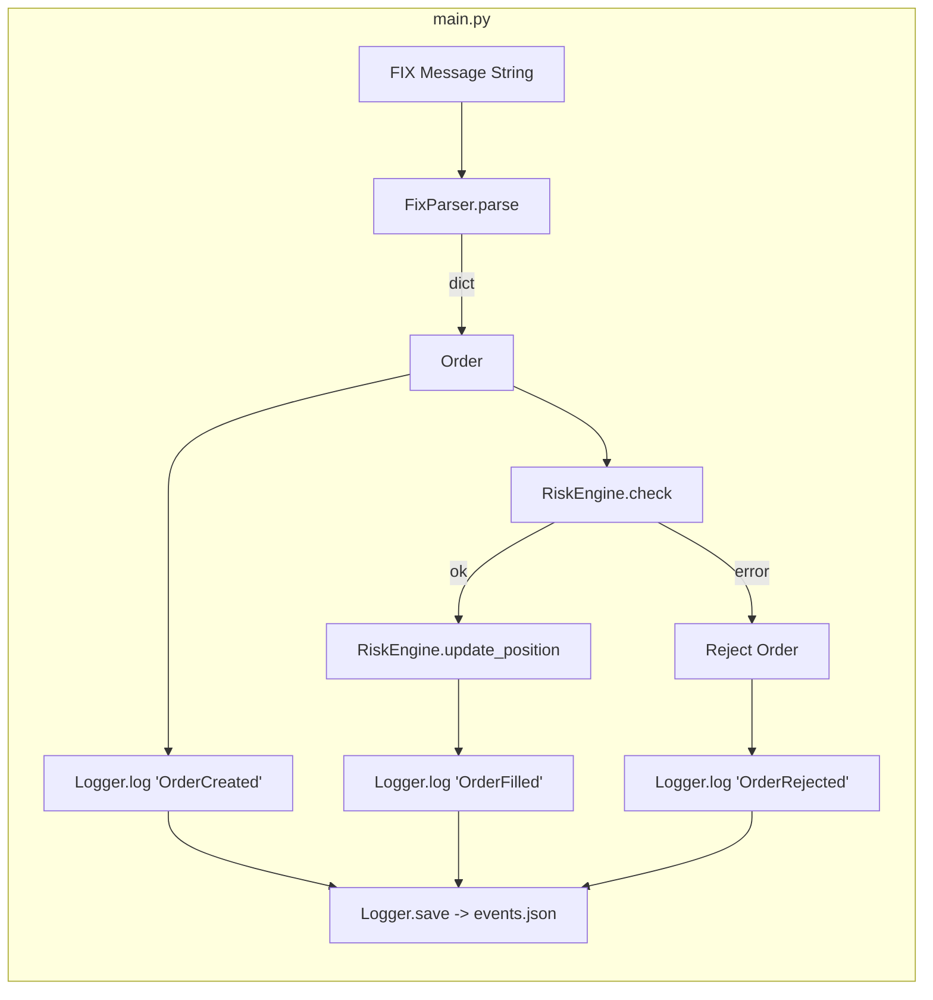

# 32500 HW9 – Simple Risk Engine & FIX Order Pipeline

This project implements a small trading “pipeline” around a risk engine:

1. Parse a simplified FIX message into a Python dictionary.
2. Convert that dictionary into an `Order` object.
3. Run the order through a `RiskEngine` that enforces basic position / size limits.
4. Log all events to a JSON file via a singleton `Logger`.
5. Provide a `main()` script plus unit tests and a coverage helper.

The code is intentionally small and self-contained so it can be tested with `pytest` and `pytest-cov`.

---

## Project Structure

```text
.
├── main.py              # Entry point: runs example scenarios and writes events.json
├── order.py             # Order model + OrderState enum and state transitions
├── risk_engine.py       # RiskEngine: max order size / position tracking & checks
├── fix_parser.py        # FixParser: parse + validate a simplified FIX message
├── logger.py            # Logger: JSON event logger (singleton)
├── events.json          # Sample output log (created by main.py)
├── run_test.py          # Helper script: run pytest + coverage and write coverage_report.md
├── coverage_report.md   # Generated test & coverage report (output of run_test.py)
└── test/
    ├── test_fix_parser.py
    ├── test_logger.py
    ├── test_main.py
    ├── test_order.py
    └── test_risk_engine.py
```

---

## High-Level Design

### Components

- **FixParser (`fix_parser.py`)**
  - Parses a simplified FIX string like  
    `8=FIX.4.2|35=D|55=AAPL|54=1|38=100|40=2|10=128`
  - Splits into key–value pairs by a configurable delimiter (default `"|"`).
  - Maps common tags (`35`, `55`, `54`, `38`, `40`) to human-readable keys.
  - Validates required fields:
    - Always requires `35` (MsgType).
    - For known message types (e.g., New Order Single `35=D`) enforces additional required tags.

- **Order & OrderState (`order.py`)**
  - `Order(symbol, qty, side)` holds basic order information.
  - `OrderState` is an enum with states like `NEW`, `ACKED`, `FILLED`, `CANCELED`, `REJECTED`.
  - `Order.transition(new_state)` enforces a simple state machine:
    - `NEW → ACKED | REJECTED`
    - `ACKED → FILLED | CANCELED`
    - Terminal states cannot transition further.

- **RiskEngine (`risk_engine.py`)**
  - Initialized with:
    - `max_order_size`: per-order notional / quantity limit.
    - `max_position`: absolute position limit per symbol.
  - Tracks positions in `self.positions` (symbol → net quantity).
  - `check(order)`:
    - Raises `ValueError` if:
      - `order.qty > max_order_size`, or
      - resulting position would exceed `max_position`, or
      - `order.side` is invalid.
  - `update_position(order)`:
    - Applies `+qty` for `BUY`, `-qty` for `SELL`.

- **Logger (`logger.py`)**
  - Singleton logger with:
    - `log(event: str, data: dict)` – append an event with timestamp.
    - `save()` – write all events to a JSON file (`events.json` by default).
  - Implemented as a classic singleton: `Logger()` always returns the same instance.

- **Main Script (`main.py`)**
  - Wires all components together and runs two scenarios:
    1. A valid order that passes risk checks and is filled.
    2. An oversized order that violates `max_order_size` and is rejected.
  - Logs events under labels like `"OrderCreated"`, `"OrderFilled"`, `"OrderRejected"`.
  - Writes the resulting event stream to `events.json`.

---

## Architecture Diagram

You can render this Mermaid diagram in compatible Markdown viewers:



---

## Setup

Tested with **Python 3.10+**.

1. **Go to the project root** (where `main.py` and `run_test.py` live):

   ```bash
   cd /Users/lin_/Desktop/32500hw9
   ```

2. (Optional but recommended) **Create a virtual environment**:

   ```bash
   python3 -m venv .venv
   source .venv/bin/activate   # Windows: .venv\Scripts\activate
   ```

3. **Install dependencies**:

   ```bash
   pip install pytest pytest-cov
   ```

---

## Running the Main Program

From the project root:

```bash
python main.py
```

This will:

- Run the built-in example scenarios.
- Print status messages to stdout.
- Create or overwrite `events.json` in the project directory with the logged events.

---

## Running Tests

### Plain pytest

From the project root:

```bash
pytest
```

This discovers and runs all tests under `test/`.

### With Coverage Helper Script

The project includes `run_test.py` that:

1. Changes into the project root.
2. Runs `pytest` with `pytest-cov` enabled (e.g., `--cov=.`).
3. Captures the terminal output.
4. Writes it into `coverage_report.md`.

Run it with:

```bash
python run_test.py
```

After it finishes, open `coverage_report.md` to see:

- A short summary (tests passed / failed).
- The full pytest log.
- A coverage summary table for each module.

---

## Notes

- `events.json` is generated output and may be overwritten each time you run `main.py` or tests that invoke `main.main()`.
- The FIX parsing logic is simplified for teaching/testing purposes and does not implement the full FIX protocol.
- Risk limits are *per symbol* and based on absolute position, not notional value.
